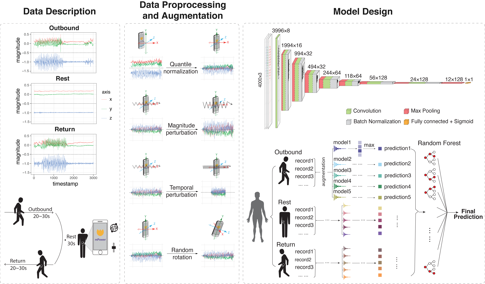

# PDDB: Parkinson's Disease Digital Biomarker
This repository contains our winning algorithm of 2017 PDDB DREAM Challenge, which utilizes gyroscope and acceletometer data from smartphones to predict Parkinson's disease.

The paper is published in Patterns Zhang H, Deng K, Li H, Albin R, Guan Y. 2020. Deep Learning Identifies Digital Biomarkers for Self-Reported Parkinson’s Disease, Patterns (2020), https://doi.org/10.1016/j.patter.2020.100042

Please contact gyuanfan@umich.edu or rayezh@umich.edu if you have any questions about this project. 
## Overall Description



## Dependencies
* [python](https://www.python.org/downloads/release/python-275/) (2.7.5)
* [perl](https://dev.perl.org/perl5/news/2013/perl-5.16.3.html) (5.16.3)
* [numpy](https://numpy.org/devdocs/release/1.14.3-notes.html) (1.14.3)
* [scipy](https://docs.scipy.org/doc/scipy-1.0.0/reference/) (1.0.0)
* [opencv-python](https://pypi.org/project/opencv-python/) (4.1.2.30)
```pip install opencv-python```
* [Theano](https://pypi.org/project/Theano/) (1.0.4)
```pip install Theano```
* [Lasagne](https://lasagne.readthedocs.io/en/latest/user/installation.html) (0.1)
```pip install Lasagne==0.1```

The model was initially developed in Lasagne 0.1 which only is only compatible with python 2.7. However, as Lasagne 0.2 is under developement and soon be avaliable, we will update our code accordingly soon in the future.

## Installation
Copy our gitclone to yout local diresctory:
```
git clone https://github.com/GuanLab/PDDB.git
```
## Input Data Format
The raw accelerometer data format is a .josn file. It can be preprocessed by running the following command:  
```
python preprocess.py
```
This program transform .json files in ./Data into .npy files that can be directly loaded in the training process. 
## Model Training 
```
cd ./training_PDDB_model
sh bash.sh
```
## Prediction Evaluation

As The mPower dataset is generally unbalanced in class, AUROC instead of AUPRC or accuracy will be more suitable in evaluating predictions. The predictions on test set is evaluated by AUROC by running:
```
python evaluation.py
```
This creates a `auc.txt` file based on preditions ensembled by Random Forest learner compared to the ground truth. 


## Model Visualization with Saliency Maps
